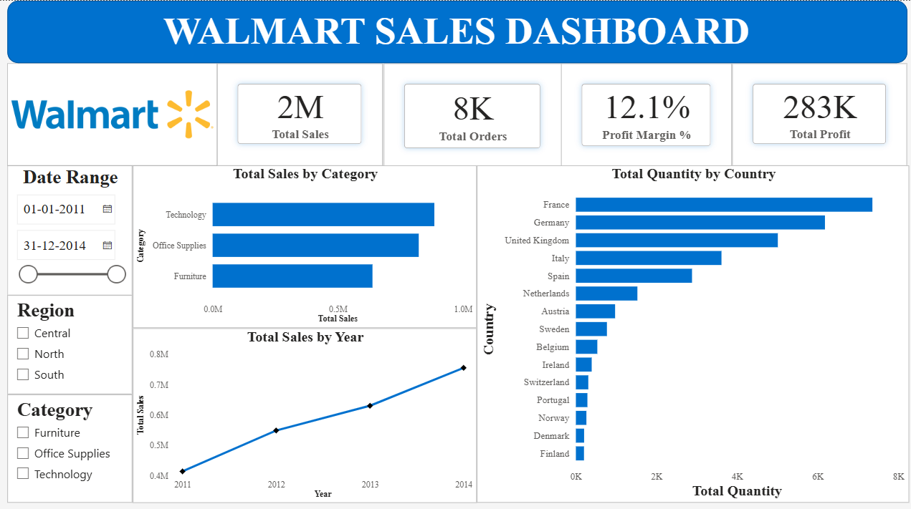
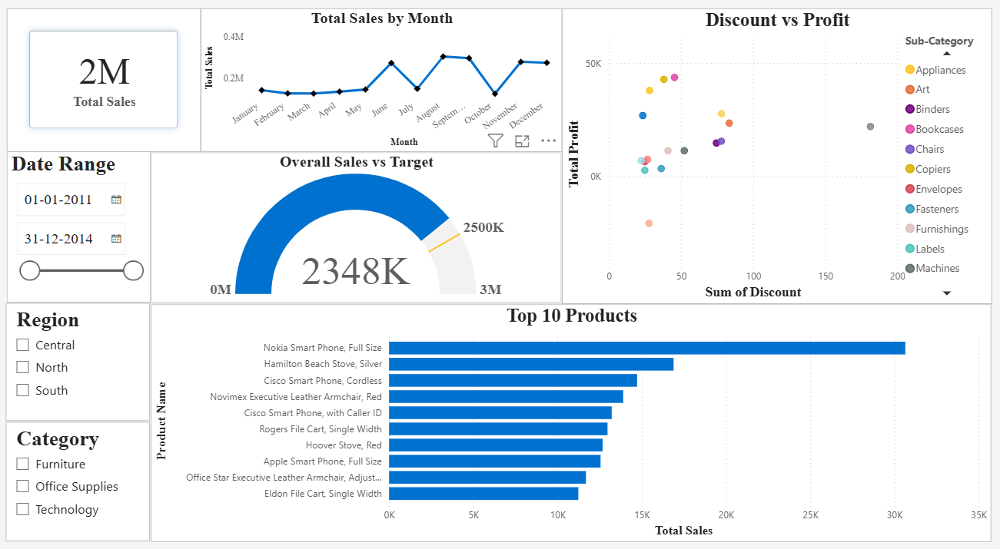
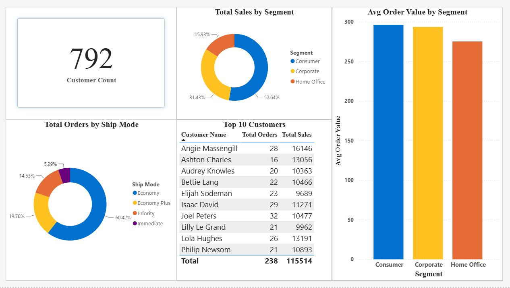

# Walmart Sales Dashboard — Power BI Case Study

## Overview

An interactive Power BI dashboard analyzing Walmart sales data (2011–2014) across regions, product categories, and customer segments. Built to practice data modeling, DAX measures, and dashboard UX design, using a dataset sourced from Kaggle.

**Tools used:** Power BI Desktop, Power Query, DAX

## Live Dashboard

🔗 [View the interactive report on Power BI Service](#) <!-- replace # with your published link -->

## Files in this repo

| File | Description |
|---|---|
| `Walmart_Sales_Dashboard.pbix` | Power BI project file |
| `Walmart_Data_sales.xlsx` | Source dataset (Kaggle) |
| `/screenshots` | Dashboard page exports |

## Data Model

The dataset (8,047 orders, 2011–2014) was loaded as a single fact table and enriched with a manually built **Targets** table (Region → Sales Target), related on `Region` in a one-to-many relationship. This enabled goal-tracking measures like Sales vs Target %.

**Key DAX measures:**
```dax
Total Sales = SUM(Sheet1[Sales])
Total Profit = SUM(Sheet1[Profit])
Profit Margin % = DIVIDE([Total Profit], [Total Sales])
Total Orders = DISTINCTCOUNT(Sheet1[Order ID])
Customer Count = DISTINCTCOUNT(Sheet1[Customer Name])
Avg Order Value = DIVIDE([Total Sales], [Total Orders])
Sales Target = SUM(Targets[Target])
Sales vs Target % = DIVIDE([Total Sales], [Sales Target]) - 1
```

## Dashboard Pages

### 1. Executive Summary
KPI cards (Total Sales, Orders, Profit Margin, Profit), sales trend by year, sales by category, and quantity sold by country. Filterable by date range, region, and category.



### 2. Sales Detail
Monthly sales trend, overall sales vs target (gauge), discount-vs-profit relationship by sub-category, and top 10 products by sales.



### 3. Customer Insights
Customer count, sales split by segment, orders by ship mode, top 10 customers, and average order value by segment.



## Key Insights

- **Total Sales** reached **2,348,492** across **8,047 orders**, generating **283,240 in profit** (a **12.1% profit margin**).
- Overall sales landed **~6% below** the combined regional target of 2,500,000, signaling room to close the gap through targeted regional pushes.
- **Technology** and **Office Supplies** are the strongest-selling categories, with **Furniture** trailing behind.
- **France, Germany, and the UK** drive the highest sales volumes among the 15 countries represented in the data.
- **792 unique customers** placed orders, with the **Consumer segment** accounting for over half (52.6%) of total sales, followed by Corporate (31.4%) and Home Office (15.9%).
- **Economy shipping** is the dominant mode, used in 60% of all orders.
- Several sub-categories show a clear profit drop-off at high discount levels, suggesting discount thresholds worth revisiting for margin protection.

## What I Learned

- Structuring a data model with a dimension table (Targets) related to a fact table, and troubleshooting relationship grain mismatches (Region vs Category groupings)
- Writing DAX measures for KPIs, ratios, and time-based comparisons
- Choosing the right visual for the message (e.g., switching a broken Matrix for a Gauge to communicate goal tracking more reliably)
- Designing a consistent, branded layout across multiple report pages with shared slicers and a unified color theme
